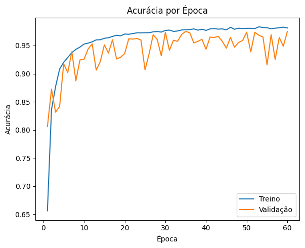
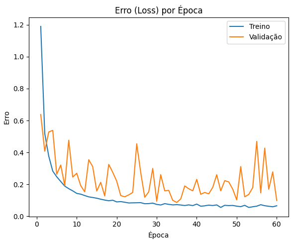

# Clorofila
# 🌿 Detecção e Classificação de Doenças em Folhas de Plantas com CNNs

Este projeto utiliza redes neurais convolucionais (CNNs) aplicadas ao conjunto de dados **PlantVillage** para identificar e classificar doenças em folhas de diferentes espécies de plantas. Ele foi desenvolvido como parte da disciplina de Visão Computacional e inclui técnicas de pré-processamento, modelagem em duas fases (detecção + classificação), avaliação de desempenho e geração de inferências.

## 🎯 Objetivos

- Detectar folhas com e sem doenças em imagens do PlantVillage.
- Classificar o tipo de doença presente em folhas identificadas como contaminadas.
- Avaliar o desempenho do modelo com métricas como acurácia, matriz de confusão e curvas de erro.
- Realizar inferência em imagens externas.

## 🧠 Modelagem

Modelo CNN treinado para classificar imagens entre *saudável* e *doente*.
Possui 10 camadas, incluindo 3 blocos convolucionais seguidos de camadas de pooling, uma camada de flatten e duas camadas densas, sendo a última responsável pela classificação final com função de ativação softmax.

### 🔍 Resultados

- **Acurácia **: XX%
- **Erro **: XX%
- **Matriz de confusão** e **curvas de acurácia/erro** disponíveis em `imgs/`

  
  

## 🧪 Inferência

Também foi implementado um notebook para **testes com novas imagens externas**. Ele realiza o pré-processamento, aplica os dois estágios da rede e retorna a classificação final com a probabilidade associada.

## 💾 Dataset

- **Fonte**: PlantVillage (via Kaggle)
- **Link**: [https://www.kaggle.com/datasets/emmarex/plantdisease](https://www.kaggle.com/datasets/emmarex/plantdisease)
- **Formato**: imagens organizadas por pasta (classe)

> ⚠️ As imagens do conjunto de dados não estão incluídas neste repositório. Recomenda-se o download direto pela fonte acima.

## ⚙️ Requisitos

- Python 3.10+
- TensorFlow 2.x
- OpenCV
- NumPy
- Matplotlib
- Scikit-learn

